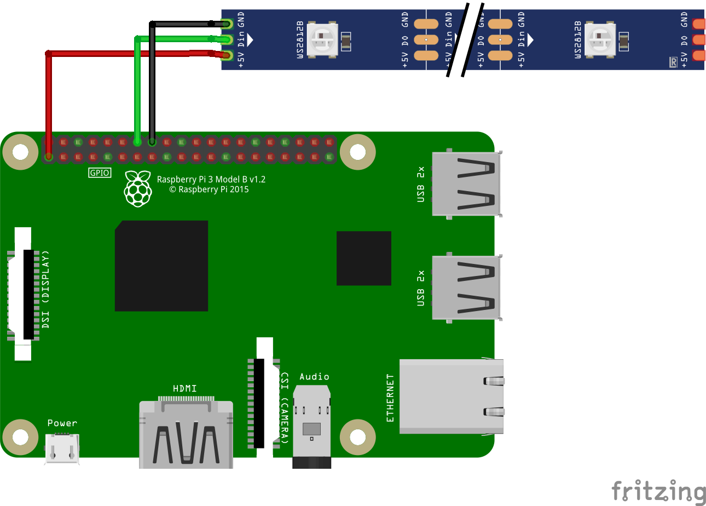

# ws2812-over-artnet
## ws2812 over artnet with a raspberrypi

**Note: The Documentation is unfinished and still in work.**

## Setup:
0. Flash your SD-Card for the Raspberry-pi.  
	I recommend using the [Raspberry Pi Imager](https://www.raspberrypi.com/software/).  
	You can use the Raspberrypy pi os lite, because there is no need for a gui.  
	I used the Version "Raspberry Pi OS Lite (32-bit) Debian Bullseye"  
	By pressing Crtl + Shift + X you get a options menu, in which you can set the host-name and enable ssh.  
	(of course you can also use balena etcher, and create a ssh-file)
1. Connect the ws2812-Strip to the raspberry pi.  
	This is a very simple way to connect the ws2821-Strip:    
	

	| ws2821-LED-Strip | Raspberry-pi               |
	|------------------|----------------------------|
	| GND              | GND (e.g. pin14)           |
	| Din              | GPIO 18 (pwm) (i.e. pin12) |
	| 5V               | +3,3 V (e.g. pin1)         |

	But this method may not work for long strips, for other connection methods see [this article](https://learn.adafruit.com/neopixels-on-raspberry-pi/raspberry-pi-wiring) by Tony DiCola from Adafruit.  
2. This is an optional step to improve the communication with the ws2812 LED-Strip  
	(This step is not necessary, and can also be done later)  
	1. open the file:  
		```bash
		sudo nano /etc/modprobe.d/snd-blacklist.conf
		```
	2. and add:  
		```
		blacklist snd_bcm2835
		```
		save and exit with Ctrl + O and Enter, and the Ctrl + X  
	3. open the next file:  
		```bash
		sudo nano /boot/config.txt
		```
	4. and change:  
		```
		# Enable audio (loads snd_bcm2835)
		dtparam=audio=on
		```
		to:  
		```
		# Enable audio (loads snd_bcm2835)
		#dtparam=audio=on
		```
		save and exit with Ctrl + O and Enter, and the Ctrl + X  
	5. reboot the Raspberry pi using:  
		```bash
		sudo reboot
		```
3. Update apt-get and install python3 and pip3:  
	```bash
	sudo apt-get update
	sudo apt-get install python3
	sudo apt-get install python3-pip
	```
	confirm if necessary with y (yes)  
4. Install the following python modules:  
	```bash
	sudo pip3 install rpi_ws281x adafruit-circuitpython-neopixel
	sudo python3 -m pip install --force-reinstall adafruit-blinka
	sudo pip3 install stupidArtnet
	```
	(And Yes, the libraries need to be installed in the Root-directory, more on that later)  

5. Copy the python files from the repo on your pi.  

6. Change the settings:  
	open the config.json file:  
	```bash
	nano config.json
	```
	and set the desired Artnet Universe Id (artnet starts counting from 0)  
	As well as the number of pixels used.  

7. Test the ws2812-Strip:
	```bash
	sudo python3 ws2812.py
	```
	(It is important to run the script with Root-privileges, so that it can access the pwm-function)  
	The first LED should light up in red, and the last one in blue, all in between should light up in green.  

	Debug:  
	- If no LEDs lights up, but there is no error message in the shell, check the wiring  
	- If the LEDs do not light up in the correct colour, but there is no error message in the shell, check the number of LEDs set in step 6 and/or do step 2.  
	- If you get an error message check the sudo privileges, the number of LEDs set in step 6, and/or do step 2.  

8. Check the Artnet-Network:
	1. Setup your DMX software.  
		(I used QLC+, for a tutorial how to set up QLC+ go [here](#qlc-artnet-setup))  
		If you need the IP-Address of the Raspberry pi use:
		```bash
		hostname -I
		```
	2. start the Artnet-test-script:
		```bash
		sudo python3 artnet.py
		```
		(Sudo must be used, because the library is installed in the Root-directory, to later function in combination with the ws2812-module)  

	3. stop the script, by pressing any key  

9. Test the ws2818 over Artnet script:  
	```bash
	sudo python3 ws2812Artnet.py

	```
	stop it with Ctrl + C (the script will then crash with an error message, which can be ignored)  

10. Setup the auto-startup of the script:  
	will follow  

11. Setup a shutdown button:  
	will follow  


## Additional Stuff:
### QLC+ Artnet Setup:
will follow  